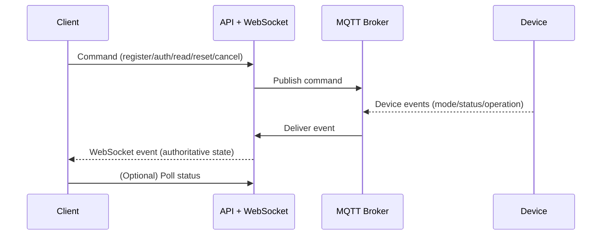

# TapService

FastAPI gateway exposing NFC reader operations via HTTP commands with real-time WebSocket events.

## Purpose

Operate NFC readers (register/write tags, authenticate, read) through a lightweight API that cleanly separates command submission (HTTP) from authoritative state (device → MQTT → service → WebSocket).

## Key Features

- Event-driven, devices are source of truth
- Unified `request_id` for tracking & cancellation
- Single WebSocket stream for all devices (client-side filtering)
- In-memory state (easy dev / pluggable for Redis later)
- Extensible operation model (add new operations with same pattern)

## Prerequisites

- Python 3.12
- `uv` package manager (https://github.com/astral-sh/uv) installed locally

## Getting Started

```bash
git clone <repo-url>
cd TapService
uv sync                       # install deps
uv run uvicorn tapservice.main:app --reload
```

Visit: http://localhost:8000/docs for interactive API.

Minimal smoke test:
```bash
curl http://localhost:8000/devices            # expect empty list initially
curl -X POST http://localhost:8000/read \
  -H 'Content-Type: application/json' \
  -d '{"device_id": "reader_01"}'          # will error if device not registered by MQTT
```

## State & Lifecycle (High Level)



Devices are authoritative; HTTP never mutates state directly.

Ephemeral: All state is in-memory; restarting clears devices & requests.

Device presence: Devices appear when MQTT status/mode events are received (no HTTP "register device" endpoint). Operations require the device to be online/idle.

## Architecture

**Event-driven pattern** with eventual consistency:

1. HTTP endpoint → MQTT command → Return `request_id`
2. Device executes → MQTT confirmation
3. MQTT handler → Update state → WebSocket broadcast

**Key principle**: Devices are authoritative. HTTP endpoints never update state directly—only MQTT handlers do when devices confirm.

**Terminology**: Device (NFC reader) · Client (API consumer) · Tag (NFC card/chip)

## API

**HTTP Endpoints**:
- `POST /register` - Start tag write (→ `request_id`)
- `POST /auth/start` - Start auth session (→ `request_id`)
- `POST /auth/{id}/user_data` - Submit credentials
- `POST /read` - Start tag read (→ `request_id`)
- `GET /devices` - List devices (paginated)
- `GET /device/{id}/status` - Device status snapshot
- `POST /device/{id}/reset` - Reset device to idle
- `GET /requests` - List operations (filtered/paginated)
- `GET /requests/{id}/status` - Operation status
- `POST /requests/{id}/cancel` - Cancel operation

**WebSocket**: `WS /events` - Real-time stream from all devices (filter by `device_id`)

## Quick Start

```bash
# Connect WebSocket for events
ws://localhost:8000/events

# Send commands
curl -X POST http://localhost:8000/register \
  -H "Content-Type: application/json" \
  -d '{"device_id": "reader_01", "tag_uid": "ABC123", "key": "secret"}'
# → {"request_id": "uuid", "status": "initiated"}

# Monitor via WebSocket or poll status
curl http://localhost:8000/requests/uuid/status

# Cancel if needed
curl -X POST http://localhost:8000/requests/uuid/cancel

# Reset device
curl -X POST http://localhost:8000/device/reader_01/reset
```

## Events

**Device**: `status_change`, `mode_change`\
**Register**: `register_waiting`, `register_writing`, `register_success`, `register_error`\
**Auth**: `auth_waiting`, `auth_tag_detected`, `auth_processing`, `auth_success`, `auth_failed`, `auth_error`\
**Read**: `read_waiting`, `read_success`, `read_error`

## Request Tracking

All operations return a `request_id` for:
- Progress polling: `GET /requests/{id}/status`
- Cancellation: `POST /requests/{id}/cancel`
- Event correlation: All WebSocket events include `request_id`

Status response: `{request_id, operation, device_id, status, created_at, metadata}`

## Query Examples

```bash
# Devices with pagination
curl "http://localhost:8000/devices?page=1&page_size=10"

# Requests with filters
curl "http://localhost:8000/requests?device_id=reader_01&operation=auth&status=waiting"
```

**Filters**: `device_id`, `operation` (auth/register/read), `status` (waiting/tag_detected/processing/completed/error/cancelled)\
**Pagination**: `page` (default 1), `page_size` (default 20, max 100)

## Development

```bash
uv sync                                              # Install deps
uv run uvicorn tapservice.main:app --reload         # Run server
uv run pytest                                        # Run tests
uv run pytest --cov=tapservice --cov-report=html    # With coverage
```

**Structure**: `main.py` (app) · `routes.py` (endpoints) · `mqtt_handlers.py` (state updates) · `schemas.py` (models) · `session_manager.py` (state) · `settings.py` (config)

## MQTT Integration

**Command topics** (HTTP publishes):
```
devices/{device_id}/{operation}/start
devices/{device_id}/{operation}/cancel
devices/{device_id}/reset
```

**Event topics** (Devices publish, handlers subscribe):
```
devices/{device_id}/status
devices/{device_id}/mode              # Authoritative state updates
devices/{device_id}/{operation}/*
```

See `mqtt_handlers.py` for complete patterns. To integrate: add MQTT client → subscribe to event topics → route to handlers → publish commands from HTTP endpoints.

## Future
- Complete MQTT client wiring
- Operation timeouts
- Redis-backed session manager
- Auth/rate limiting
- Metrics/monitoring
- Docker deployment
